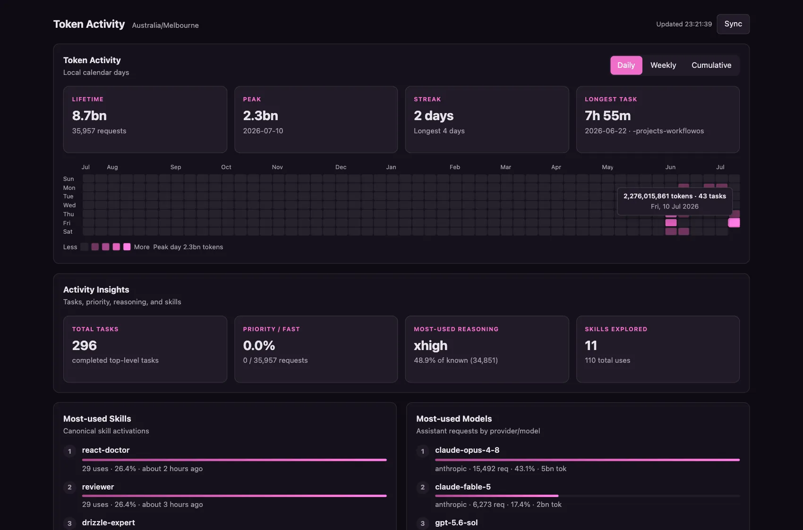
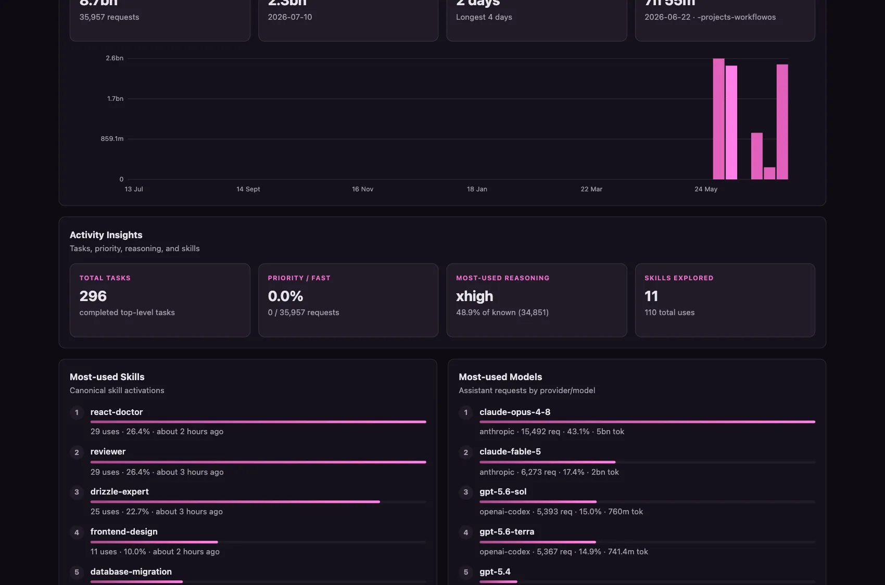
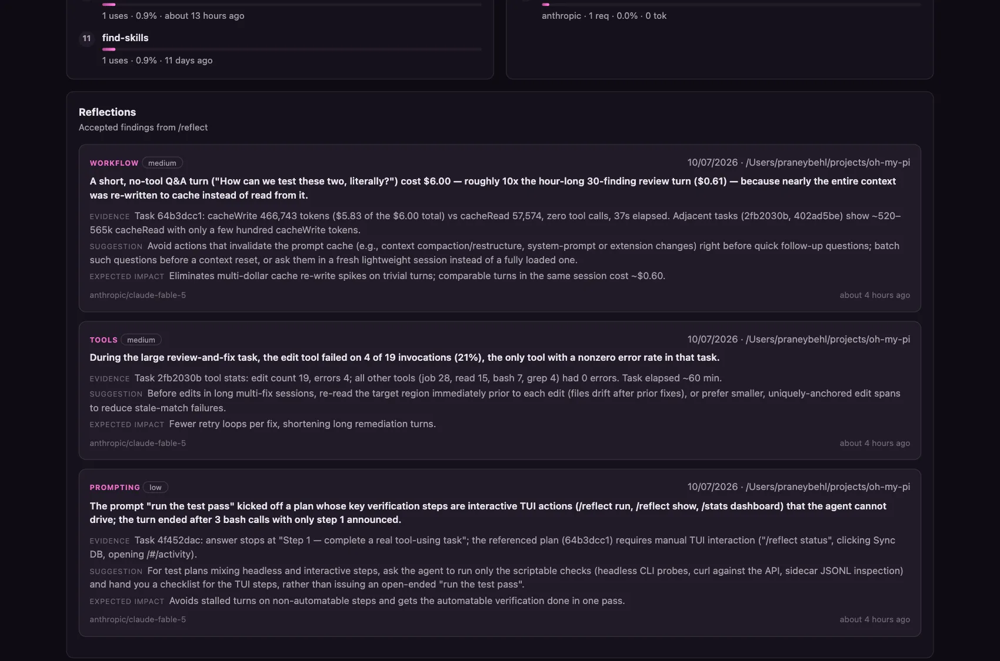

# omp-reflect

**Activity Reflections** — an [oh-my-pi](https://github.com/can1357/oh-my-pi) plugin that audits your recent coding-agent sessions with your own active model and produces short, actionable findings about prompt and workflow efficiency: better prompting patterns, model choice, reasoning effort, skill usage, and tool habits.

> **Plugin or extension?** Both, at different layers. In omp an *extension*
> is a JS/TS module whose default export is a factory
> `(pi: ExtensionAPI) => void`, loaded fresh per session; omp discovers
> extensions from three sources — `.omp/extensions/` capability directories
> (project, then user), enabled *plugins*, and configured paths
> (`extensions.paths` settings or `--extension` flags). A *plugin* is an
> npm-style package installed under `~/.omp/plugins` and tracked in the
> `plugins.json` ledger (`omp plugin install/upgrade/disable/uninstall`);
> its `"omp"` manifest — or convention directories — can ship extensions,
> themes, skills, commands, and tools. This repo is a plugin shipping
> exactly one extension (`"omp": { "extensions": ["./src/index.ts"] }`).
> Installing the plugin auto-loads it in every session; `omp --extension
> <path>` loads the same module directly for a single session. Loaded paths
> are deduplicated by resolved absolute path, so combining both loads two
> copies — pick one.

Findings, transcript activity, and their dashboard are self-contained: the extension runs on a stock published **omp 16.3.15** without an oh-my-pi PR or host database access. Browse findings in-session with `/reflect show`, or inspect the complete local Activity view with `/activity`.

## How it works (short version)

1. The extension reads your local session logs and keeps its own small sqlite database. All of this stays on your machine.
2. When you run `/reflect run` (or auto mode kicks in), it makes **one** model call — by default to the same model your session is already using, or to a model you pin with `/reflect model <spec>` (e.g. a cheaper one). Never a silent fallback to anything else.
3. That call never contains your full conversation. It sends short excerpts from up to 6 recent tasks — your prompt (trimmed to 2,000 chars), the final answer (trimmed to 3,000 chars), and usage stats like time, cost, reasoning effort, tool counts, and skills — plus aggregate numbers about your top models and tools. The whole payload is hard-capped at 24,000 characters, and secrets are scrubbed before anything is sent.
4. Tool arguments and results, images, system prompts, and subagent transcripts are **never** sent.
5. The model replies with up to 3 short findings. They're stored locally and shown in `/reflect show` and on the `/activity` dashboard.

So the only thing that ever leaves your machine is that one bounded, sanitized call to your configured provider — a run costs cents (last real run: $0.18). Full details in [What the model sees](#what-the-model-sees-and-what-it-never-sees).

## Screenshots

The `/activity` dashboard — lifetime/peak/streak/longest-task cards, a GitHub-style heatmap with instant tooltips, and skill/model rankings, all from your real session history:



Weekly token chart (Daily/Weekly/Cumulative toggle):



Accepted `/reflect` findings in the Reflections feed — category, confidence, evidence, suggestion, and expected impact per finding:



```
┌────────────────────────────┐
│ host session JSONL +        │
│ __omp-reflect.jsonl sidecars│
└──────────────┬─────────────┘
               │ incremental extension parser
┌──────────────▼────────────────────────────────────┐
│ ~/.omp/agent/omp-reflect-activity.sqlite           │
│ extension-owned; never host stats.db                │
└───────────┬───────────────────────┬────────────────┘
            │                       │
┌───────────▼────────────┐  ┌───────▼─────────────────┐
│ standalone observability│  │ /activity HTTP dashboard │
│ models (top 8), tools   │  │ local server + vanilla UI │
│ (top 12)                │  └─────────────────────────┘
└───────────┬────────────┘
            │ bounded, sanitized payload
┌───────────▼────────────────────────────────────────┐
│ active session model + forced `respond` tool        │
│ ≤3 reflection findings                              │
└─────────────────────────────────────────────────────┘
```

When a future host exposes `ctx.stats`, it is auto-detected and preferred for reflection observability; the extension still keeps its own Activity database and dashboard.

## Requirements

- [Bun](https://bun.sh) ≥ 1.3
- A stock published **oh-my-pi 16.3.15** installation is sufficient. `ctx.stats` is optional: when present it enriches reflection observability automatically; when absent the extension uses its own incremental activity pipeline.
- One configured model credential — reflections use your **active session model** by default, or a model you pin with `/reflect model <spec>`. There is never a silent fallback to another model.

## Install

One command, using omp's native plugin manager — installs into
`~/.omp/plugins` and auto-loads in every session:

```bash
omp plugin install github:praneybehl/omp-reflect
```

Or the equivalent script (also handles machines where `omp` isn't on PATH
yet by falling back to a local clone):

```bash
curl -fsSL https://raw.githubusercontent.com/praneybehl/omp-reflect/main/install.sh | sh
```

Manage it like any other plugin:

```bash
omp plugin upgrade omp-reflect     # pull the latest ref
omp plugin disable omp-reflect     # keep installed, stop loading
omp plugin uninstall omp-reflect
```

### Manual / development load

```bash
git clone https://github.com/praneybehl/omp-reflect
cd omp-reflect && bun install
omp --extension /path/to/omp-reflect
# or, from an oh-my-pi source checkout:
bun packages/coding-agent/src/cli.ts --extension ../omp-reflect
```

The package manifest (`"omp": { "extensions": ["./src/index.ts"] }`) makes the directory itself loadable, both as a plugin and via `--extension`.

## Commands

| Command | Effect |
|---|---|
| `/reflect run` | Wait for idle, audit the **next batch of up to 6 uncovered tasks**, persist the attempt, notify accepted-finding count and the model used. Already caught up? Reports "Nothing new to reflect on" without recording an attempt. Bypasses the 24 h cadence, but not another process's active lease. |
| `/reflect show` (or bare `/reflect`) | Browse the latest accepted findings — observation as the label, evidence/suggestion as the description. Esc closes. Empty state: `No reflections yet. Run /reflect run.` |
| `/reflect status` | Auto state, active model, **coverage watermark** (`N/M tasks (insights through <timestamp>)`), last attempt/success, retry floor, lease holder. |
| `/reflect model [spec\|clear]` | Show or pin the model used for reflection runs. Specs use the same forms as `--model` (`provider/id`, bare id, role alias) and are validated before saving; `clear` follows the active session model again. The pin persists across sessions and applies to auto mode too. |
| `/reflect auto on\|off` | Persist automatic mode (see below). |
| `--reflect-daily` (CLI flag) | Enable auto mode for **this process only**, without rewriting the persisted switch. |
| `/activity` (or `/activity open`) | Sync once if needed, start or reuse the local Activity dashboard, show its URL, and best-effort open it in the desktop browser. |
| `/activity sync` | Incrementally parse the host session JSONL into the extension-owned activity database and report records/files processed. |
| `/activity status` | Show the dashboard URL (or `stopped`), last sync counts, and the extension database path. |
| `/activity stop` | Stop the local dashboard server; it is also stopped during `session_shutdown`. |

## Activity dashboard

`/activity` serves a dependency-free local dashboard from an ephemeral loopback port. It presents the same useful-at-a-glance Activity shape as the host reference: lifetime tokens and request/task headline metrics, peak day/streak/longest-task cards, a 52-week Sunday-keyed calendar with zero days materialized, weekly and cumulative inline-SVG charts, priority/reasoning/skill/model breakdowns, and accepted reflection findings. Hovering a calendar cell or chart point updates its tooltip immediately.

Its database is `${getAgentDir()}/omp-reflect-activity.sqlite` (normally `~/.omp/agent/omp-reflect-activity.sqlite`). It is independent of `~/.omp/stats.db`; opening, syncing, stopping, or shutting down the dashboard never opens or writes the host database.

## Automatic mode

With auto enabled, a reflection is scheduled after `agent_end` on a **top-level interactive** session (print/RPC/ACP modes and nested subagents are skipped). Scheduling is conservative:

- at most one success per **24 hours**; failed scheduled attempts retry no sooner than **1 hour**;
- a cross-process **lease** (2 min TTL, 30 s heartbeat) in `~/.omp/agent/omp-reflect.sqlite` prevents two OMP processes from auditing concurrently — a crashed holder recovers after expiry;
- runs only audit task windows **not already covered** by a previous successful reflection of that session (see below);
- switching or shutting down the session aborts an in-flight owned run and records it as `aborted`; a late completion can never commit under a lost lease.

## Ongoing coverage, not one-off audits

Reflection is a continuous process with a durable watermark, mirroring how
observability sync works: the sidecar's successful attempts record which task
windows (`sourceEntryIds`) the insights are already based on, and **every run
— manual or scheduled — selects only the next batch of up to 6 uncovered
windows**. Repeated runs therefore walk backward through the backlog until the
whole session is covered; new tasks re-open the backlog as they complete.

Six is the *per-attempt batch bound* protecting the 24,000-character payload,
1,600-token response, and 90-second deadline — it is not the coverage horizon.
`/reflect status` reports where the watermark stands
(`coverage: 4/9 tasks (insights through 2026-07-10T09:15:00Z)`), and a run with
nothing uncovered is the caught-up steady state: it notifies and records no
attempt, so it never burns the retry floor.

## What the model sees (and what it never sees)

Each audit sends one bounded, sanitized payload:

- The next batch of up to 6 uncovered task windows: the user prompt (≤ 2,000 chars), the final assistant answer (≤ 3,000 chars), elapsed time, effective reasoning level, provider usage/cost, tool names/counts/error flags, and activated skills.
- On a stock host, the extension first incrementally syncs its own activity database, then supplies bounded extension-owned model aggregates (top 8) and tool aggregates (top 12). The snapshot is marked `source: "standalone"` and deliberately leaves behavior matrices and gain totals empty.
- When `ctx.stats` is available, that host facade wins automatically after its own sync: it supplies 30-day and lifetime behavior-by-model matrices (top 8 each, with one active-model reservation), all-time model aggregates (top 8), 30-day tool usage (top 12) and active-model tool breakdown (top 12), plus project Snapcompact gain totals. Standalone mode does **not** emulate behavior matrices, gain, or official `/stats` integration.
- The complete payload — observability JSON included — is capped at **24,000 characters**.

Excluded always: tool arguments and results, images, system prompts, hidden custom message bodies, and subagent transcripts.

Before dispatch, project and global secret entries are reloaded and every excerpt passes a sanitizer that obfuscates secrets and neutralizes prompt-injection control delimiters (`<|system|>`, `[INST]`, ANSI/C0 sequences, …). The same obfuscation is applied to persisted model output; reflection output is never deobfuscated.

The prompts additionally forbid psychological or causal claims about the user, restrict model-comparison findings to models with ≥ 10 responding messages or requests, and prohibit correctness/test claims that the supplied metrics don't prove.

## The reflection call

- Model: the pinned `/reflect model` spec when set (resolved at run time with the same resolver as `--model`), otherwise the active session model — always via the host's key resolution. A missing model, unresolvable pin, or missing credential records a non-dispatched failure — no fallback.
- One forced structured `respond` tool; low reasoning effort when the model supports it; **1,600** max output tokens; default (non-priority) tier; **90 s** deadline.
- At most **3 findings** are accepted. Each must match the wire schema — category (`prompting | model | reasoning | skills | tools | workflow`), observation, evidence, suggestion, expected impact, confidence (`low | medium | high`), and known source entry ids. Unknown ids, empty fields, invalid shape, or a provider error/abort reject the attempt (`invalid` / `provider_error` / `aborted`).

## Persistence & the wire contract

Every dispatched attempt writes an append-only **sidecar** next to the audited session's artifacts:

```
~/.omp/agent/sessions/<project>/<session>/__omp-reflect.jsonl
```

One `omp.activity-reflection.start` entry before dispatch and exactly one `omp.activity-reflection.finish` entry (`success | invalid | provider_error | aborted`) after — including reported provider usage even for failed responses, since those are real billed requests. Raw excerpts and raw provider errors are never persisted.

`src/wire.ts` mirrors the host's `packages/stats/src/reflection-wire.ts` (schema version 1) so this package installs from published dependencies alone; `test/wire.test.ts` asserts exact constant equality against a sibling oh-my-pi checkout to catch drift. The extension's incremental parser folds session activity and reflection sidecars into its own database, where they power `/activity`'s reflection feed, token totals, model ranking, and reflection agent share. A host `ctx.stats` facade, if available, remains a separate optional source for the richer reflection-only aggregates above.

Sessions are resolved by **stable session id** before every sidecar write: moved sessions write at their new path; dropped sessions discard late finishes and never recreate old directories.

## Non-goals

Reflect never writes memories or managed skills, never injects advice into the conversation, never interrupts or continues the agent loop, and never estimates compaction savings. It never opens or writes the host `stats.db`; its only analytics store is the extension-owned activity database.

## Development

```bash
bun install --frozen-lockfile
bun run check   # biome + tsgo --noEmit
bun test        # 28 tests across 6 files
```

| Path | Responsibility |
|---|---|
| `src/index.ts` | Extension factory: `/reflect` command, `--reflect-daily` flag, auto-mode lifecycle hooks |
| `src/wire.ts` | Mirrored sidecar wire contract (constants + payload types) |
| `src/host-stats.ts` | Structural `ctx.stats` guard against the published `ExtensionContext` |
| `src/observability.ts` | Prefers host aggregates when available; otherwise bounds extension-owned model/tool aggregates |
| `src/analytics/*` | Extension-owned incremental JSONL parser, SQLite lease store, and Activity aggregates |
| `src/dashboard/*` | Dependency-free loopback Activity dashboard server and vanilla UI |
| `src/snapshot.ts` | Task-window extraction, selection, and payload bounding |
| `src/sanitizer.ts` | Secret obfuscation + control-delimiter neutralization |
| `src/runner.ts` | The model call: forced `respond` tool, validation, acceptance |
| `src/recorder.ts` | Serialized sidecar writer with owner re-resolution |
| `src/schedule.ts` | `bun:sqlite` cadence state + cross-process lease |
| `src/ui/findings.ts` | `/reflect show` presentation |
| `src/prompts/*.md` | System/user prompt templates |

See [AGENTS.md](./AGENTS.md) for the rules that keep this extension safe to modify.
